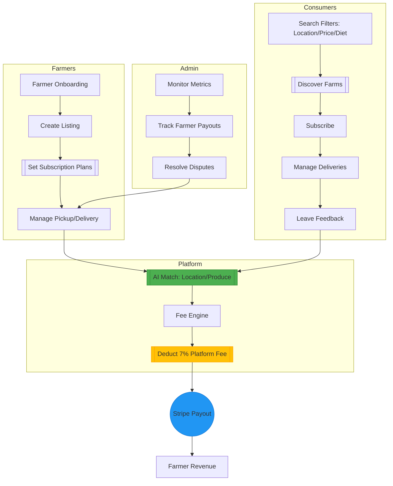

# FarmLink 🌱
**Direct Farm-to-Table Connections**

[](https://opensource.org/licenses/MIT)
[](https://stripe.com)


## Project Overview
This project is a React web application that enables local farmers to list their Community Supported Agriculture (CSA) shares and allows community members to browse and purchase them. Our goal is to:

- 🌾 Support local agriculture through direct farm-to-consumer connections
- 🛒 Simplify CSA share discovery and management
- 🤝 Foster community engagement around sustainable farming practices
- 💳 Provide secure payment infrastructure for agricultural transactions

## Key Features

### 🌾 Farmer Features
- CSA share listing management
- Subscription tier configuration
- Payment onboarding via Stripe Connect
- Delivery scheduling tools

### 🛒 Consumer Features
- Location-based farm discovery
- CSA share comparison tools
- Subscription management dashboard
- Secure checkout process

## The Challenges We Address

<div align="center" style="margin: 2rem 0">
  
</div>

### Farmer Challenges
**Unstable Revenue Streams**  
Small farms remain dependent on volatile markets with:
- No guaranteed weekly income
- High customer acquisition costs
- Limited direct-to-consumer infrastructure

### Consumer Pain Points
**Inaccessible Local Food**  
Despite demand, shoppers face:
- Fragmented farm discovery
- Inconvenient pickup options
- No quality standardization

## Tech Stack

### Frontend
- **React 18** with Vite (TSX) - Core UI framework
- **Tailwind CSS** 3.4 - Styling system
- **React Query** 5.62 - Server state management
- **React Router** 7.0 - Client-side routing

### Backend
- **Express** 4.21 - REST API server
- **Prisma** 6.0 - Database ORM
- **PostgreSQL** - Primary datastore
- **JWT** 9.0 - Authentication tokens

### DevOps
- **TypeScript** 5.7 - Static typing
- **Jest** 29.7 - Testing framework
- **GitHub Actions** - CI/CD pipeline
- **Render** - Deployment hosting

## Our Approach



## Development Phases

### Phase 1 - Core Transaction Flow
- Farmer payment onboarding
- Basic subscription management
- Location-based search

### Phase 2 - Retention Features
- Subscription modification tools
- Delivery notifications
- Farm discovery system

### Phase 3 - Scaling Tools
- Bulk management interface
- Mobile delivery tracking
- Farmer analytics

## Getting Started

```bash
# Local development
git clone https://github.com/yourrepo/farmlink
cd farmlink
npm install
cp .env.example .env
npm run dev
```

## Documentation
- [Farmer Onboarding](docs/FARMER_ONBOARDING.md)  
- [API Endpoints](docs/API_REFERENCE.md)  
- [Payment Flow](docs/PAYMENTS.md)

## Contribute
We welcome farmers, developers, and local food advocates. See our [contributing guidelines](CONTRIBUTING.md).