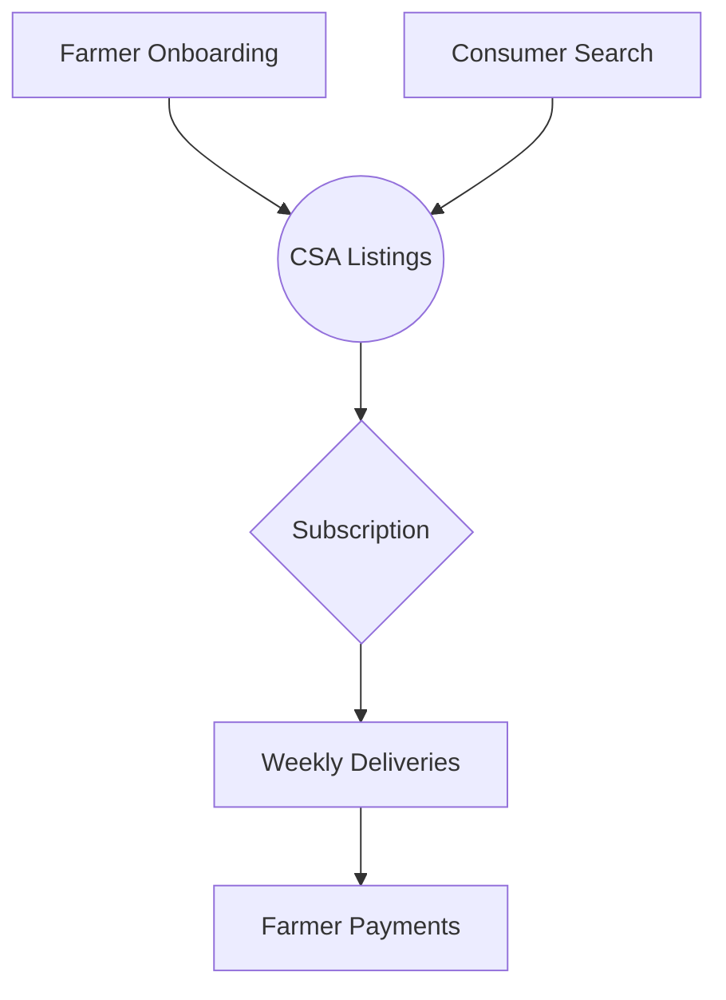

# FarmLink 🌱
**Direct Farm-to-Table Connections in 3 Clicks**

[](https://opensource.org/licenses/MIT)
[](https://stripe.com)

## The Challenges We Address

<div align="center" style="margin: 2rem 0">
  
</div>

### 🌾 Farmer Challenges
**Unstable Revenue Streams**  
Small farms remain dependent on volatile markets with:
- No guaranteed weekly income
- High customer acquisition costs
- Limited direct-to-consumer infrastructure

### 🛒 Consumer Pain Points
**Inaccessible Local Food**  
Despite demand, shoppers face:
- Fragmented farm discovery
- Inconvenient pickup options
- No quality standardization

## Our Approach



## Technical Implementation

### Current Foundation
```typescript:src/components/farm/FarmProfileView.tsx
export const FarmProfileView = ({ profile }) => (
  <div className="space-y-4">
    <FarmHeader name={profile.name} />
    <LocationMap coordinates={profile.location} />
    <SubscriptionTiers tiers={profile.tiers} />
  </div>
)
```

### Immediate Focus
```typescript:server/index.ts
// Next priority: Payment onboarding
app.post('/api/stripe-connect', async (req, res) => {
  const account = await stripe.accounts.create({
    type: 'standard',
    email: req.user.email
  });
  // Save Stripe account to farm profile
});
```

## Development Phases

### Phase 1 - Core Transaction Flow
- Farmer payment onboarding
- Basic subscription management
- Location-based search

### Phase 2 - Retention Features
- Subscription modification tools
- Delivery notifications
- Farm discovery system

### Phase 3 - Scaling Tools
- Bulk management interface
- Mobile delivery tracking
- Farmer analytics

## Getting Started

```bash
# Local development
git clone https://github.com/yourrepo/farmlink
cd farmlink
npm install
cp .env.example .env
npm run dev
```

## Documentation
- [Farmer Onboarding](docs/FARMER_ONBOARDING.md)  
- [API Endpoints](docs/API_REFERENCE.md)  
- [Payment Flow](docs/PAYMENTS.md)

## Contribute
We welcome farmers, developers, and local food advocates. See our [contributing guidelines](CONTRIBUTING.md).