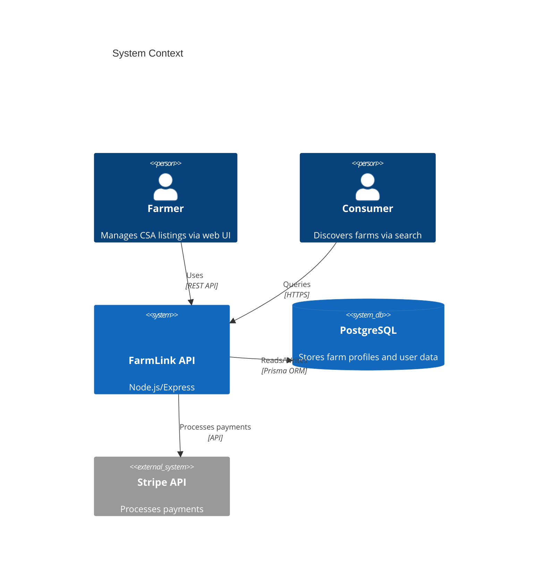
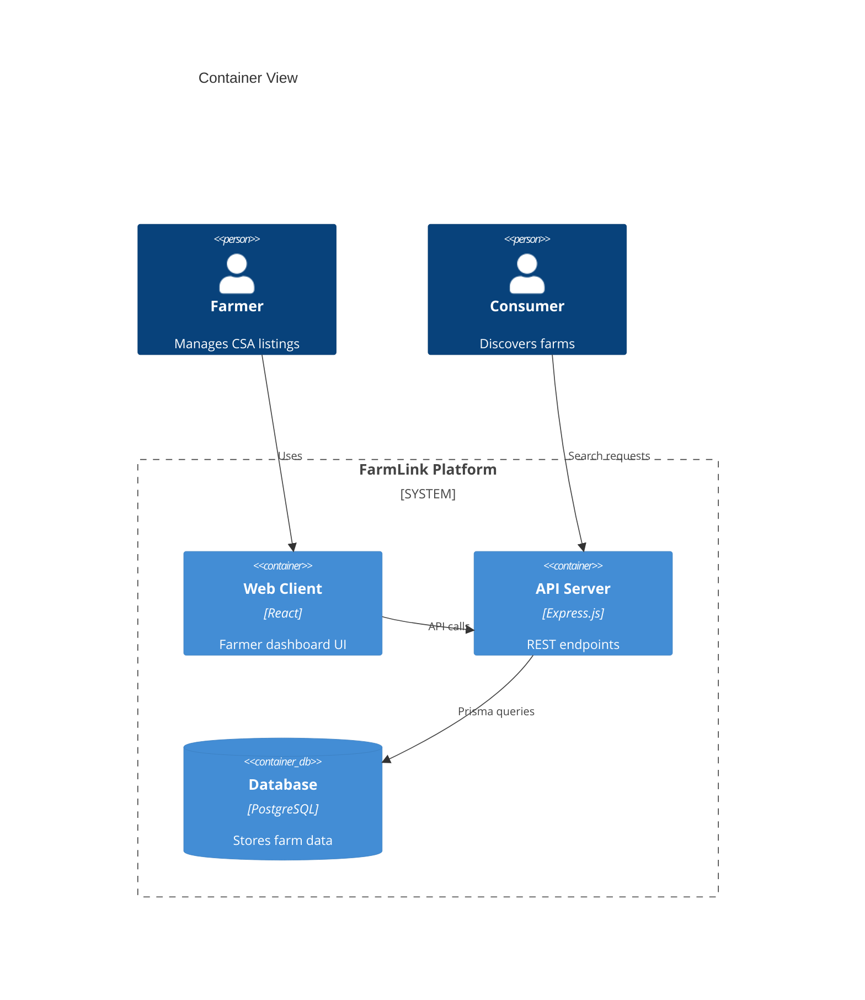

# FarmLink Architecture (v2.1)

## Design Principles
1. **Farm-Centric Scaling**: Regional sharding for produce types
2. **Fault Isolation**: Bulkhead pattern for payment processing
3. **Zero-Downtime**: Blue/green deployment ready
4. **Data Locality**: GDPR-compliant storage architecture

## System Context

---

## Container Diagram

---

## Quality Attributes
| Attribute | Current Implementation |
|-----------------|-----------------------------------|
| Security | JWT auth, password hashing |
| Resilience | Prisma connection pooling |
| Performance | Eager loading in API endpoints |
| Maintain | TypeScript, Express router modules|