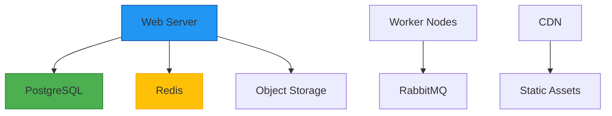

# FarmLink Deployment Guide

## Infrastructure Requirements



## Environment Configuration

### Required Services
| Service          | Version  | Purpose |
|------------------|----------|----------------------------|
| Farm Service     | Node 18+ | Manages farm profile data  ß|
| PostgreSQL       | 15+      | Primary operational data   |
| Redis            | 7+       | Caching & sessions         |
| RabbitMQ         | 3.12+    | Message queue              |
| Object Storage   | S3-compat| User uploads & assets      |

### Recommended Cloud Setup
```bash
# Example AWS setup
aws ec2 create-instance \
  --image-id ami-0abcdef1234567890 \
  --instance-type t3.medium \
  --tag-specifications 'ResourceType=instance,Tags=[{Key=Name,Value=farmlink-web}]'

# Database cluster
aws rds create-db-cluster \
  --engine postgres \
  --db-cluster-identifier farmlink-db \
  --master-username postgres \
  --master-user-password "$DB_PASSWORD"
```

## Monitoring Stack
- **Metrics**: Prometheus + Grafana
- **Logging**: ELK Stack (Elasticsearch, Logstash, Kibana)
- **APM**: New Relic or OpenTelemetry
- **Alerting**: Opsgenie/PagerDuty integration

## Scaling Strategies
1. **Vertical Scaling**: Upgrade instance sizes for database and cache
2. **Horizontal Scaling**: Add web/worker nodes behind load balancer
3. **Geo-Distribution**: Deploy regional CDN endpoints
4. **Database Sharding**: Split by region/tenant using Prisma hints 