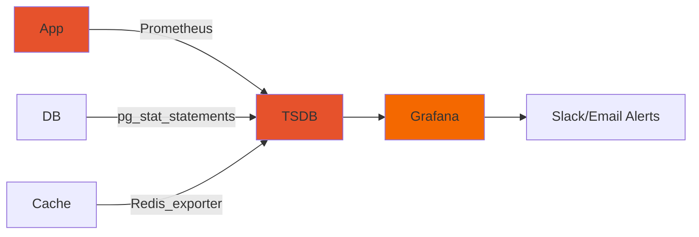

# Observability Stack

## Metrics Pipeline


## Key SLOs
```yaml
api_version: monitoring.farmlink/v1
spec:
  availability:
    description: "Core transaction API availability"
    rolling_period: 28d
    objective: 99.95%
    budget: 0.05%
  latency:
    description: "Payment processing p99"
    threshold: 2.5s
    objective: 99%
  freshness:
    description: "Search index delay"
    max_lag: 60s
```

## Alert Hierarchy
```mermaid
mindmap
  root(FarmLink Alerts)
    Critical
      PaymentFailures > 5%/5m
      DBConnectionPool > 90%
    High
      API Latency > 2s p 