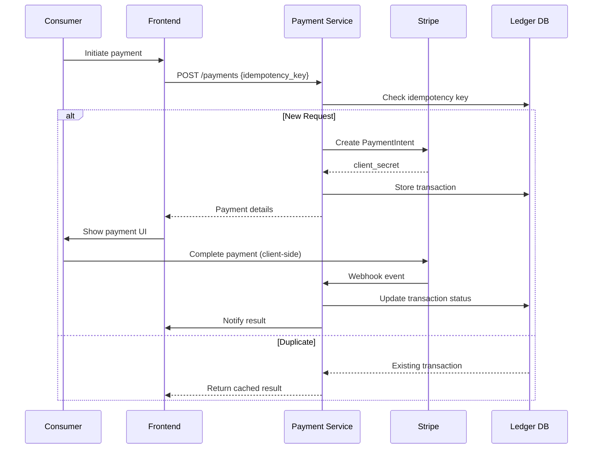
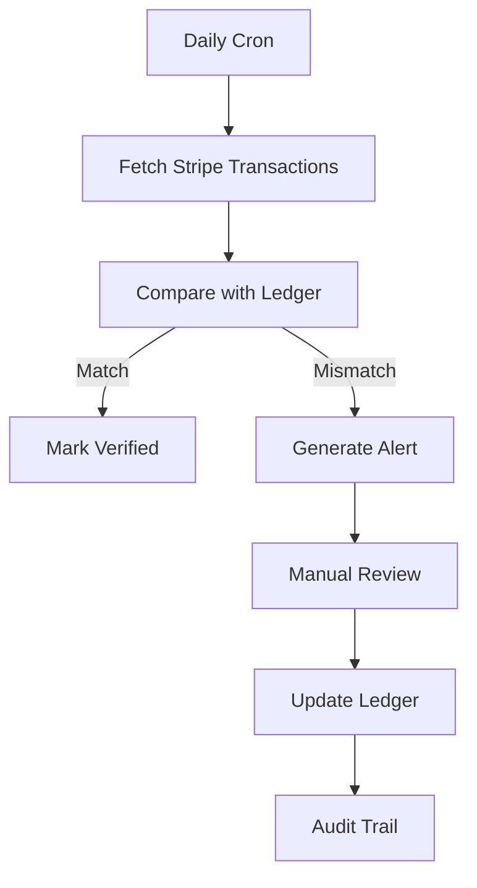

# Payment Subsystem Architecture

## Idempotent Payment Flow

## Reconciliation Process

## Failure Modes
| Scenario          | Mitigation                          | Recovery Process                 |
|-------------------|-------------------------------------|-----------------------------------|
| Double charging   | Idempotency keys                   | Automated refunds                |
| Webhook loss      | Stripe event replay                | Manual sync via API              |
| Currency mismatch | Pre-check farm settings            | Convert via ECB rates + 0.5% fee | 