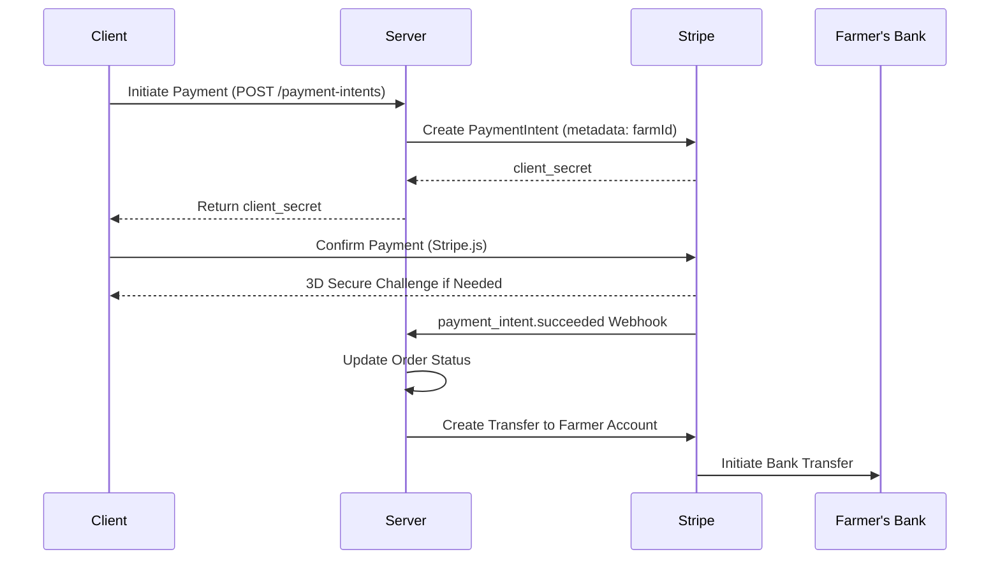

# FarmLink Payment Integration Strategy

## Core Design Philosophy
**Why This Approach?**
1. **Minimize PCI Compliance Scope**  
   By using Stripe Elements on the client side, we avoid handling raw payment details, reducing compliance overhead.

2. **Idempotent Operations**  
   Ensures accidental duplicate requests don't charge users twice, critical for agricultural transactions where users might refresh during slow connections.

3. **Farm-Centric Payouts**  
   Direct Stripe Connect integration allows farmers to receive payments directly while maintaining platform oversight.

## Optimized Payment Flow


**Key Decisions:**
- **Client-Side Confirmation**  
  Reduces server load and keeps payment data off your infrastructure
- **Webhook-Driven Updates**  
  Ensures reliable payment status tracking even if users close the browser
- **Delayed Transfers**  
  Allows for 7-day payment holds to mitigate agricultural product risks

## Implementation Details

### Client-Side (React)
```typescript:src/components/PaymentForm.tsx
const handlePayment = async () => {
  const { error } = await stripe.confirmPayment({
    elements,
    confirmParams: {
      return_url: `${window.location.origin}/payment-complete`,
    },
    redirect: 'if_required',
  });

  if (error) {
    // Handle immediate client-side errors
    setPaymentError(error.message);
  } else {
    // Poll server for webhook confirmation
    startPaymentStatusPolling(paymentIntentId);
  }
};
```

**Why:**  
- Handles 3D Secure authentication seamlessly
- Allows custom post-payment UX while maintaining security
- Implements status polling as fallback for webhook delays

### Server-Side (Express)
```typescript:server/routes/payments.ts
router.post('/payment-intents', async (req, res) => {
  try {
    const paymentIntent = await stripe.paymentIntents.create({
      amount: calculateOrderTotal(req.body),
      currency: 'usd',
      payment_method_types: ['card'],
      metadata: {
        farmId: req.body.farmId,
        userId: req.user.id,
        platformFee: calculatePlatformFee(req.body)
      }
    });

    await prisma.payment.create({
      data: {
        status: 'requires_payment_method',
        stripeId: paymentIntent.id,
        amount: paymentIntent.amount,
        currency: paymentIntent.currency,
        farmId: req.body.farmId,
        userId: req.user.id
      }
    });

    res.json({ clientSecret: paymentIntent.client_secret });
  } catch (error) {
    handlePaymentError(error, res);
  }
});
```

**Why:**  
- Creates audit trail before payment confirmation
- Stores platform fee calculation for reconciliation
- Uses TypeScript interfaces for type-safe Stripe interactions

## Reconciliation System
```typescript:server/jobs/reconciliation.ts
const reconcilePayments = async () => {
  const stripePayments = await stripe.paymentIntents.list({
    created: { gte: unixTimeYesterday }
  });

  const dbPayments = await prisma.payment.findMany({
    where: { createdAt: { gte: new Date(Date.now() - 86400000) } }
  });

  const discrepancies = findMismatches(stripePayments, dbPayments);

  if (discrepancies.length > 0) {
    await prisma.discrepancy.createMany({
      data: discrepancies.map(d => ({
        type: 'PAYMENT_MISMATCH',
        details: JSON.stringify(d)
      }))
    });
    triggerAdminAlert();
  }
};
```

**Why:**  
- Runs daily to catch issues early
- Stores discrepancies for audit purposes
- Uses Prisma batch operations for efficiency

## Security Measures
```typescript:server/middleware/security.ts
export const verifyStripeWebhook = async (req, res, next) => {
  const signature = req.headers['stripe-signature'];
  try {
    req.event = stripe.webhooks.constructEvent(
      req.rawBody,
      signature,
      process.env.STRIPE_WEBHOOK_SECRET
    );
    next();
  } catch (err) {
    logSecurityEvent('INVALID_STRIPE_SIGNATURE', { ip: req.ip });
    res.status(400).send(`Webhook Error: ${err.message}`);
  }
};
```

**Why:**  
- Prevents webhook spoofing
- Logs security events for monitoring
- Uses raw body parsing to ensure signature validity

## Farmer Payout Schedule
```typescript:server/jobs/payouts.ts
const processFarmerPayouts = async () => {
  const payableOrders = await prisma.payment.findMany({
    where: {
      status: 'succeeded',
      payoutId: null,
      createdAt: { lte: new Date(Date.now() - 7 * 86400000) }
    },
    include: { farm: true }
  });

  for (const payment of payableOrders) {
    const transfer = await stripe.transfers.create({
      amount: payment.amount - payment.platformFee,
      currency: payment.currency,
      destination: payment.farm.stripeAccountId,
      metadata: {
        paymentId: payment.id,
        farmId: payment.farmId
      }
    });

    await prisma.payout.create({
      data: {
        amount: transfer.amount,
        currency: transfer.currency,
        status: transfer.status,
        stripeTransferId: transfer.id,
        paymentId: payment.id,
        farmId: payment.farmId
      }
    });
  }
};
```

**Why:**  
- Enforces 7-day payment holding period
- Handles platform fee deduction transparently
- Creates audit trail for all transfers
- Supports multiple currencies

## Testing Strategy
```typescript:test/payment.test.ts
describe('Payment Integration', () => {
  it('should handle successful payment flow', async () => {
    // Mock Stripe client
    const mockStripe = {
      paymentIntents: {
        create: jest.fn().mockResolvedValue({
          id: 'pi_test',
          client_secret: 'secret_test',
          status: 'requires_payment_method'
        })
      }
    };

    // Test server endpoint
    const response = await request(app)
      .post('/payment-intents')
      .send({ farmId: 'farm_123', amount: 10000 });

    expect(response.status).toBe(200);
    expect(mockStripe.paymentIntents.create).toHaveBeenCalled