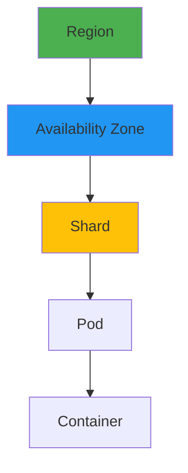

# Horizontal Scaling Strategy

## Farm Density Scaling


## Auto-Scaling Rules
```terraform
resource "aws_appautoscaling_policy" "api" {
  name               = "farmlink-api-scale"
  service_namespace  = "ecs"
  resource_id        = "service/farmlink-api"
  scalable_dimension = "ecs:service:DesiredCount"
  
  target_tracking_scaling_policy_configuration {
    predefined_metric_specification {
      predefined_metric_type = "ECSServiceAverageCPUUtilization"
    }
    target_value = 60
  }

  step_scaling_policy_configuration {
    adjustment_type         = "ChangeInCapacity"
    cooldown                = 300
    metric_aggregation_type = "Average"

    step_adjustment {
      metric_interval_lower_bound = 0
      scaling_adjustment          = 2
    }
  }
}
```

## Sharding Strategy
| Shard Key         | Use Case                  | Pros                      | Cons                |
|-------------------|---------------------------|---------------------------|---------------------|
| Farm ID           | Transactional data        | Strong consistency        | Hotspot risk        |
| Geo Hash          | Search queries            | Locality optimization     | Range query cost    |
| Produce Category  | Inventory management      | Query isolation           | Cross-shard joins   |
``` 